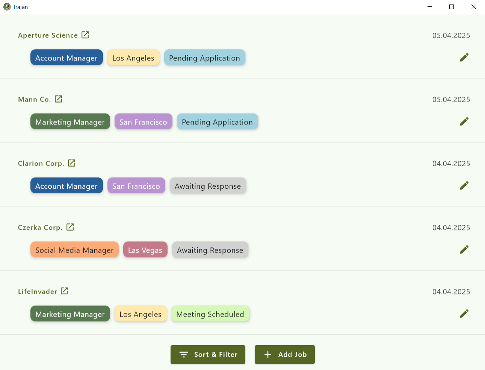
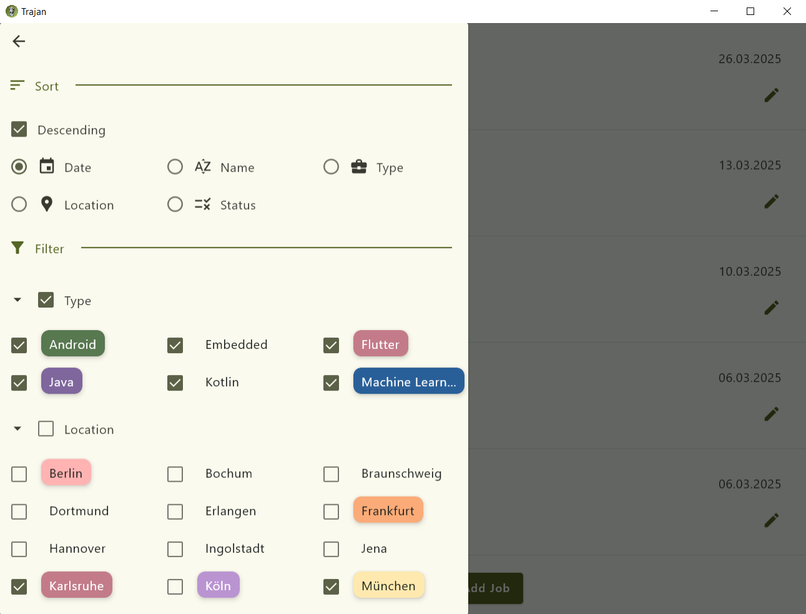

<div align="center" style="margin-bottom: 20px">
  
</div>

Tracking Assistant for Job Applications (TRAJAN) is a free open-source 
software designed to assist those looking to start or change their 
careers by keeping track of their job applications.

## Features

<div align="center" style="margin-bottom: 10px">
  
</div>
 
Trajan can be used to save interesting job postings in a list including the name of the company, the type of the job position, the  location of work, as well as a status keeping track of whether an application has been sent and whether a positive or negative response has been received from the employer. Each of these attributes can be assigned a color for easier recognition. Additional details about a job can be saved in a text field. 

<div align="center" style="margin-bottom: 10px">
  
</div>

For a better overview, Trajan provides the necessary tools to sort and filter the list. Jobs can be sorted by Date or alphabetically on Name, Type, Location or Status, as well as filtered by Type, Location and Status.

Trajan is lightweight and runs locally on your device. 
It is a Kotlin Multiplatform project and is available on Windows, Linux and Android.
Learn more about [Kotlin Multiplatform](https://www.jetbrains.com/help/kotlin-multiplatform-dev/get-started.html) and 
[Compose Multiplatform](https://github.com/JetBrains/compose-multiplatform/#compose-multiplatform).

## Installation

The latest release of Trajan can be found [here](https://github.com/coslu/trajan/releases/).

### Windows:
Download and run the `.msi` file to install through installer. 

When updating from a previous version, you can install in the same directory. The installer will warn that the folder already exists. You can safely replace the contents of the folder.

OR 

Download and extract the `.zip` file and launch the application through `Trajan.exe`.

### Linux:

Download and run the `.deb` file to install through your software manager.

If your distribution does not support `.deb` packages, [build from source](#building-from-source).

### Android:

Download and run the `.apk` file. 

If you haven't done so before, you will need to give your browser permission to install applications. 
Follow the instructions on your screen. 

Play Protect may ask to scan the app before installation. Let it scan.

### Building From Source:

Have JDK version 23.0.1 or later installed, for example from [Oracle](https://www.oracle.com/java/technologies/downloads/). Make sure to have the `bin` directory of your JDK installation in your `PATH` environment variable ([Link for reference](https://www.java.com/en/download/help/path.html)).

Download and extract the Trajan source zip or tarball.

If on Linux, make the file `gradlew` an executable by:
```
chmod +x gradlew
```

Run:

```
./gradlew createDistributable
```

An executable to launch the app can then be found in `./composeApp/build/compose/binaries/main/app/Trajan`